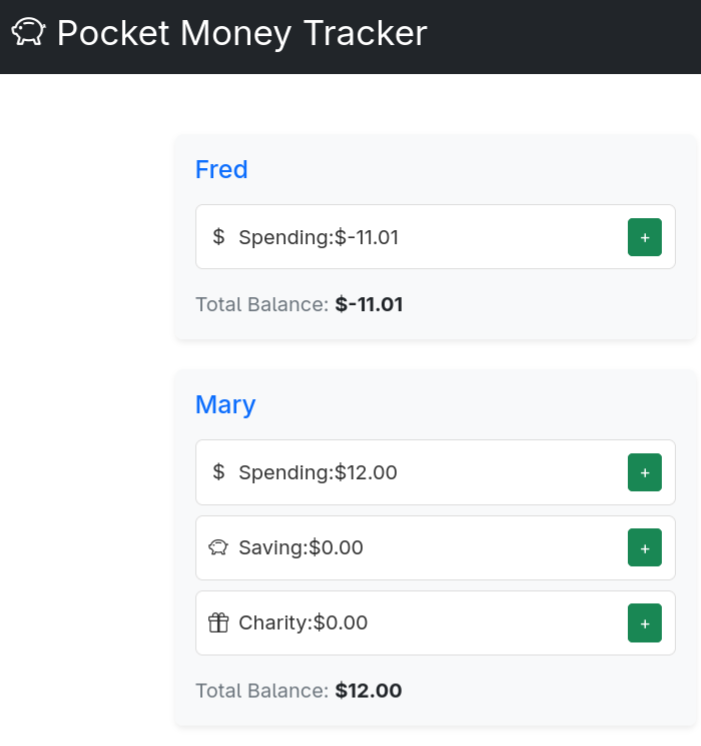

# PocketMoney
PocketMoney is a self-hosted website for managing your kids (or your own) pocket money. You can create children, add accounts to each child (E.g. Spending, Saving, and Charity) and have money automatically allocated to their accounts.

 

## Install

PocketMoney is provided via a \docker image. It is presumed you run your own reverse proxy providing SSL and other protections, or access only on your local network.

- Download the [compose.yaml](compose.yaml) 
- Update the default username and password - you can remove this line after the first startup
- Set the ports to [your port]:80, where [your port] is whatever port you wish to access PocketMoney on
- Set your base domain (or [server ip[]:[port] / localhost:[port] if accessing locally)
- Start the container with `docker compose up -d`
- Go to your domain to access PocketMoney

If you're having trouble, feel free to [create an issue](https://github.com/Neriderc/PocketMoney/issues/new) and I will see if I can help.

## Contribute

You can contribute in a number of ways.
- Code contributions are welcome
- If you can't code, feel free to open an issue to request features or report bugs
- Currently there are no translations to other languages. Maybe you'd like it if there were? Open an issue and let me know if you're willing to translate.

## Dev environment

These instructions may may assumptions around your environment, so please let me know if there were other steps you needed to do or if you are unable to set up your dev environment.

### Clone the repository
`git clone https://github.com/Neriderc/PocketMoney.git`

### Install dependencies

Install any extra dependencies as needed. E.g. composer or npm, PHP, etc

`cd PocketMoney/backend`  
`composer install`  

`cd ../frontend`  
`npm install`

And build the frontend:  
`npm run build`

## Compile the container
Ensure you are in the root of the repository then run:
`docker build --build-arg APP_ENV=dev -t pocketmoney:dev .`

The APP_ENV part is important as without it you won't get the dev tools needed to run in dev mode with debug enabled in the next step.

### Start container

Now create the compose.yaml file:
```
services:
  pocketmoney:
    image: pocketmoney:dev
    ports:
      - "8000:80"
    volumes:
      - ./data/db:/var/www/backend/var/db
    environment:
      APP_ENV: dev
      APP_DEBUG: 1
      DATABASE_URL: sqlite:///%kernel.project_dir%/var/db/data.db
      DEFAULT_USERNAME: admin
      DEFAULT_PASSWORD: changeme
```

Then access it at http://localhost:8000